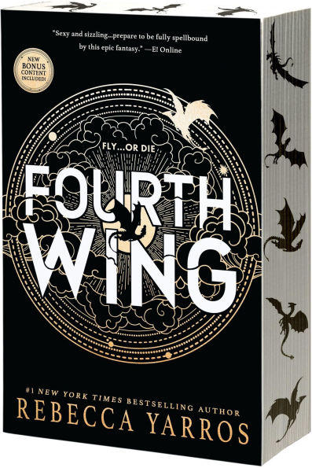

```{r setup, include=FALSE}
knitr::opts_chunk$set(echo = TRUE)
library(postcards)
```


 
## Bio

Hi everyone! My name is Caroline Zhuang and I'm currently a Junior at UT Austin
studying Statistics and Data Science with a Minor in Business and a CS 
Certificate. Outside of my studies, I'm into reading, running, latte art and 
trying new cafes. I also have a dog named Butter and he is a Labrador and Beagle 
mix. 

## Education

**The University of Texas at Austin** | Austin, TX

B.S. in Statistics and Data Science

## Reading List
* Fourth Wing by Rebecca Yarros
* Crown of Midnight (Throne of Glass Series) by Sarah J. Maas 
* All the Bright Places by Jennifer Wren

## Pictures

| {width=150px} | {width=150px} | {width=150px}
|----------------------------|----------------------------|----------------------------|


Time built:
```{r, echo = FALSE}
Sys.time()
```
